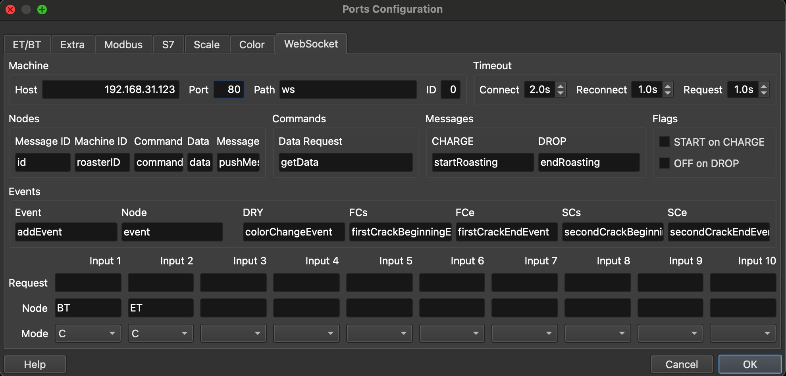
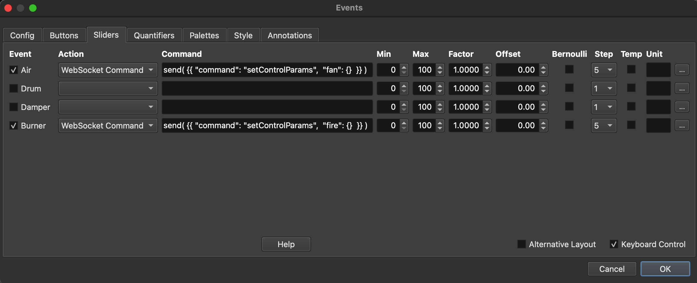

# SkywalkerWebsocket
Purpose: use ESP32 to control Skywalker roaster

This program is modified from: https://github.com/jmoore52/SkywalkerRoaster. 
This program is only for using ESP32 to communicate and control Skywalker roaster by using Artisan scope. 
The WiFi function of ESP32 may not stable, please use this program carefully and take risk by yourself.

Must do:
1. Set the Config/Port... in Artisan as follows.

2. Set the Config/Events as follows.

The message format between Artisan and ESP32 is JSON. For example:

send( {{ "command": "setControlParams",  "fan": 60 }})

is used to set the fan speed as 60%.

Requirements of package version: 
Arduino IDE Borads Manager 
esp32 by Espressif: 2.0.17 
Arduino ESP32 Boards: 2.0.12 
